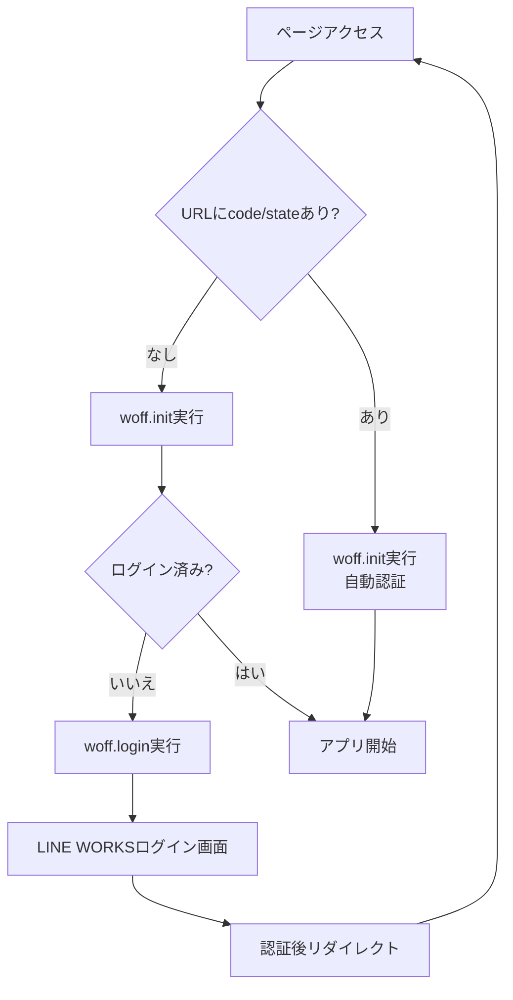

# LINE WORKS WOFF 外部ブラウザ対応で必ず知っておくべきOAuth認証フローの落とし穴

## はじめに

LINE WORKS の WOFF（Works Front-end Framework）アプリケーションを開発していて、外部ブラウザでの動作に悩んでいませんか？

「LINE WORKSアプリ内では動くのに、PCブラウザだとエラーになる...」
「`woff.login()` の後の処理が実行されない...」
「`invalid_request:redirect_uri is not valid` エラーが出る...」

これらは全て、**OAuth認証フローの理解不足**が原因です。

本記事では、WOFF開発者が陥りがちな落とし穴と、正しい実装方法を解説します。

## TL;DR

- `woff.login()` はページをリダイレクトするため、その後のコードは実行されない
- 外部ブラウザでの認証は「非同期処理の継続」ではなく「新しいページロード」として設計する
- URLパラメータ（`code`、`state`）の有無で認証前後を判断する

## よくある間違い

### ❌ 間違い1: `woff.login()` の後に処理を続けようとする

```javascript
// これは動きません！
woff.login().then(() => {
    console.log("ここには絶対に到達しない");
    authStore.isLoggedIn = true; // 実行されない
});
```

### ❌ 間違い2: async/awaitで同期的に処理しようとする

```javascript
// これも動きません！
async function login() {
    await woff.login({ redirectUri: "https://example.com" });
    // ↓ この行は実行されない（ページがリダイレクトされるため）
    console.log("ログイン完了！");
}
```

### ❌ 間違い3: 認証後も再度ログイン処理を呼ぼうとする

```javascript
// OAuth認証後のリダイレクト時
woff.init({ woffId }).then(() => {
    if (!woff.isLoggedIn()) {
        woff.login(); // 不要！URLパラメータがあれば自動認証される
    }
});
```

## 正しい実装方法

### 完全動作サンプル（HTML + CSS + JavaScript）

#### index.html
```html
<!DOCTYPE html>
<html lang="ja">
<head>
    <meta charset="UTF-8">
    <meta name="viewport" content="width=device-width, initial-scale=1.0">
    <title>WOFF アプリケーション</title>
    <link rel="stylesheet" href="style.css">
</head>
<body>
    <div class="container">
        <h1>WOFF サンプルアプリ</h1>
        
        <!-- 初期化状態表示 -->
        <div id="status" class="status loading">
            <span class="spinner"></span>
            <span id="statusText">WOFF SDKを初期化しています...</span>
        </div>
        
        <!-- ユーザー情報表示エリア -->
        <div id="userInfo" class="user-info" style="display: none;">
            <h2>ユーザー情報</h2>
            <p>名前: <span id="userName">-</span></p>
            <p>ログイン状態: <span id="loginStatus">-</span></p>
        </div>
        
        <!-- エラー表示エリア -->
        <div id="errorInfo" class="error" style="display: none;">
            <p id="errorMessage"></p>
        </div>
    </div>
    
    <!-- WOFF SDK -->
    <script charset="utf-8" src="https://static.worksmobile.net/static/wm/woff/edge/3.7.1/sdk.js"></script>
    <!-- アプリケーションスクリプト -->
    <script src="app.js"></script>
</body>
</html>
```

#### style.css
```css
.container {
    max-width: 600px;
    margin: 50px auto;
    padding: 20px;
    font-family: sans-serif;
}

.status {
    padding: 20px;
    border-radius: 8px;
    text-align: center;
    margin: 20px 0;
}

.status.loading {
    background-color: #fff3cd;
    border: 1px solid #ffc107;
    color: #856404;
}

.status.success {
    background-color: #d4edda;
    border: 1px solid #28a745;
    color: #155724;
}

.status.error {
    background-color: #f8d7da;
    border: 1px solid #dc3545;
    color: #721c24;
}

.spinner {
    display: inline-block;
    width: 16px;
    height: 16px;
    border: 2px solid #f3f3f3;
    border-top: 2px solid #333;
    border-radius: 50%;
    animation: spin 1s linear infinite;
}

@keyframes spin {
    0% { transform: rotate(0deg); }
    100% { transform: rotate(360deg); }
}

.user-info {
    background-color: #f8f9fa;
    padding: 20px;
    border-radius: 8px;
    margin-top: 20px;
}

.error {
    background-color: #f8d7da;
    color: #721c24;
    padding: 15px;
    border-radius: 8px;
    margin-top: 20px;
}
```

#### app.js
```javascript
// WOFF ID設定（Developer Consoleから取得）
const WOFF_ID = 'YOUR_WOFF_ID';

// DOM要素の取得
const elements = {
    status: document.getElementById('status'),
    statusText: document.getElementById('statusText'),
    userInfo: document.getElementById('userInfo'),
    userName: document.getElementById('userName'),
    loginStatus: document.getElementById('loginStatus'),
    errorInfo: document.getElementById('errorInfo'),
    errorMessage: document.getElementById('errorMessage')
};

// 状態表示の更新
function updateStatus(type, message) {
    elements.status.className = `status ${type}`;
    elements.statusText.textContent = message;
}

// エラー表示
function showError(message) {
    elements.errorMessage.textContent = message;
    elements.errorInfo.style.display = 'block';
}

// ユーザー情報表示
function showUserInfo(profile, isLoggedIn) {
    elements.userName.textContent = profile ? profile.displayName : 'ゲスト';
    elements.loginStatus.textContent = isLoggedIn ? 'ログイン済み' : '未ログイン';
    elements.userInfo.style.display = 'block';
}

// メインの初期化関数
async function initializeWOFF() {
    try {
        // 1. 現在の状態を確認
        const urlParams = new URLSearchParams(window.location.search);
        const hasOAuthParams = urlParams.has('code') && urlParams.has('state');
        
        console.log('OAuth認証パラメータ:', hasOAuthParams ? 'あり' : 'なし');
        
        // 2. WOFF SDK初期化
        await woff.init({ woffId: WOFF_ID });
        
        // 3. 環境とログイン状態を確認
        const isInClient = woff.isInClient();
        const isLoggedIn = woff.isLoggedIn();
        
        console.log('LINE WORKS内ブラウザ:', isInClient);
        console.log('ログイン状態:', isLoggedIn);
        
        // 4. 外部ブラウザで未ログインかつOAuth認証前の場合のみログイン
        if (!isInClient && !isLoggedIn && !hasOAuthParams) {
            updateStatus('loading', 'ログイン画面へリダイレクトします...');
            
            // redirectUriは現在のページのベースURLを指定
            woff.login({
                redirectUri: window.location.origin + window.location.pathname
            });
            
            // ⚠️ ここから下は実行されません！
            return;
        }
        
        // 5. ログイン済みの場合の処理
        updateStatus('success', '✅ WOFF SDK初期化完了');
        
        if (isLoggedIn) {
            const profile = await woff.getProfile();
            console.log('ユーザー情報:', profile);
            showUserInfo(profile, true);
        } else {
            showUserInfo(null, false);
        }
        
    } catch (error) {
        console.error('WOFF初期化エラー:', error);
        updateStatus('error', '❌ 初期化エラー');
        showError(error.message);
    }
}

// WOFF SDKの読み込み待機
function waitForWOFFSDK() {
    return new Promise((resolve) => {
        const checkInterval = setInterval(() => {
            if (typeof woff !== 'undefined') {
                clearInterval(checkInterval);
                resolve();
            }
        }, 100);
        
        // 10秒でタイムアウト
        setTimeout(() => {
            clearInterval(checkInterval);
            showError('WOFF SDKの読み込みがタイムアウトしました');
        }, 10000);
    });
}

// ページ読み込み時に実行
window.addEventListener('DOMContentLoaded', async () => {
    await waitForWOFFSDK();
    initializeWOFF();
});
```

## 認証フローの図解



## よくある実装パターン

### シンプルなログインボタンを実装する場合

```html
<!-- login.html -->
<!DOCTYPE html>
<html lang="ja">
<head>
    <meta charset="UTF-8">
    <meta name="viewport" content="width=device-width, initial-scale=1.0">
    <title>WOFF ログイン</title>
    <style>
        .login-container {
            max-width: 400px;
            margin: 100px auto;
            text-align: center;
            padding: 40px;
            background: #f5f5f5;
            border-radius: 10px;
        }
        .login-button {
            background-color: #00C73C;
            color: white;
            border: none;
            padding: 15px 40px;
            font-size: 16px;
            border-radius: 5px;
            cursor: pointer;
        }
        .login-button:hover {
            background-color: #00A832;
        }
    </style>
</head>
<body>
    <div class="login-container">
        <h2>LINE WORKSでログイン</h2>
        <p>このアプリを使用するにはLINE WORKSアカウントでログインしてください</p>
        <button id="loginBtn" class="login-button">ログイン</button>
    </div>
    
    <script charset="utf-8" src="https://static.worksmobile.net/static/wm/woff/edge/3.7.1/sdk.js"></script>
    <script>
        const WOFF_ID = 'YOUR_WOFF_ID';
        
        document.getElementById('loginBtn').addEventListener('click', async () => {
            try {
                await woff.init({ woffId: WOFF_ID });
                
                // ログインページへリダイレクト
                woff.login({
                    redirectUri: window.location.origin + '/index.html'
                });
            } catch (error) {
                alert('ログインに失敗しました: ' + error.message);
            }
        });
    </script>
</body>
</html>
```

### 実装時の考慮事項

1. **ページ遷移の管理**
   ```javascript
   // URLパラメータを保持したまま別ページへ遷移
   if (hasOAuthParams) {
       window.location.href = '/dashboard.html' + window.location.search;
   }
   ```

2. **セッション管理**
   ```javascript
   // ログイン状態をlocalStorageに保存（オプション）
   if (woff.isLoggedIn()) {
       localStorage.setItem('woffLoggedIn', 'true');
       localStorage.setItem('woffLoginTime', new Date().toISOString());
   }
   ```

3. **複数ページでの状態共有**
   ```javascript
   // 共通のinit関数を別ファイルで定義
   // common.js
   window.initWOFFCommon = async function(callback) {
       try {
           await woff.init({ woffId: WOFF_ID });
           if (callback) callback();
       } catch (error) {
           window.location.href = '/error.html?message=' + encodeURIComponent(error.message);
       }
   };
   ```

## デバッグのコツ

### 1. 状態を可視化する

```javascript
function debugWOFFState() {
    const urlParams = new URLSearchParams(window.location.search);
    
    console.group('WOFF Debug Info');
    console.log('URL:', window.location.href);
    console.log('OAuth code:', urlParams.get('code') || 'なし');
    console.log('OAuth state:', urlParams.get('state') || 'なし');
    console.log('isInClient:', woff.isInClient());
    console.log('isLoggedIn:', woff.isLoggedIn());
    console.log('WOFF Version:', woff.getVersion());
    console.groupEnd();
}
```

### 2. エラーパターンを理解する

| エラーメッセージ | 原因 | 対処法 |
|---|---|---|
| `invalid_request:redirect_uri is not valid` | OAuth認証時のredirect_uriが不正 | `woff.login()`に正しいredirectUriを指定 |
| `有効でないクライアント情報です` | WOFF IDが無効またはパラメータ不足 | Developer ConsoleでWOFF IDを確認 |
| `woff is not defined` | SDK読み込み失敗 | script tagの配置を確認 |

## まとめ

WOFF外部ブラウザ対応の重要ポイント：

1. **`woff.login()` はリダイレクト** - その後のコードは実行されない
2. **認証フローはステートレス** - ページロードごとに状態を判断
3. **URLパラメータで認証状態を判別** - `code`と`state`の有無をチェック
4. **SPAでは特別な配慮が必要** - ルーターがパラメータを削除する前に処理

これらを理解すれば、LINE WORKSアプリ内ブラウザと外部ブラウザの両方で動作する堅牢なWOFFアプリケーションを開発できます。

## 参考リンク

- [LINE WORKS Developers - WOFF](https://developers.worksmobile.com/jp/reference/woff)
- [実装サンプル（GitHub）](https://github.com/iwaohig/woff-sample-app)

## 最後に

この記事が役に立ったら、ぜひLGTMをお願いします！
質問やコメントもお待ちしています。

#LINEWORKS #WOFF #OAuth #JavaScript #認証